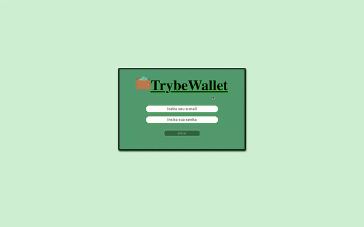

# Trybewallet
Neste repositório contém o codigo desenvolvido no projeto Trybewallet durante o curso da [Trybe](https://www.betrybe.com/) feito pelo aluno [Matheus Marinho](https://www.linkedin.com/in/matheus-marinhodsp/).

---

## Tecnologias usadas

HTML, CSS, HOFs, Javascript, React, Redux, Operações Assíncronas e Requisições a API's.

---

## Demonstração de uso

O Projeto em si tem a finalidade de criar uma "carteira de despesas" fazendo a conversão do Real para a moeda escolhida usando a cotação atual da moeda por meio de uma requisição a api do awesomeapi, adicionando a despesa a uma tabela contando com Descrição, Tag(Categoria), Método de pagamento, Valor, Moeda, Câmbio utilizado(cotação atual), Valor convertido e Moeda de conversão.
Além disso possui dois botões um para alteração da despesa alvo e um para exclusão da mesma.

---
